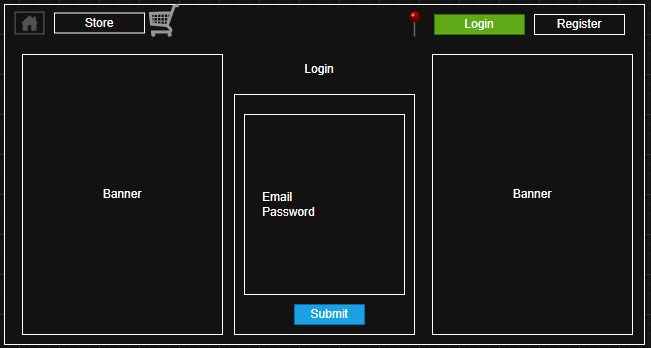

## Demo Pet Finder Application 
NOTICE: Document Work in Progress
### By <b>Jason Clair</b>
This project is to showcase my software engineering with focus on OOP, TDD, SDLC, and many other standard practices.

# Document History
| Date (yyyy-mm-dd) | Description |
|:-----------|:-------------------------------------:|
| 2025-10-11 | Updated general outline for README.md |

# Index
### Introduction
[Introduction](#introduction-bookmark) 
[Purpose of the Document](#purpose-bookmark) 
[Project Scope](#project-scope-bookmark) 
[Related Documents](#related-documents-bookmark) 
[Terms/Acronyms and Definitions](#terms-acronyms-definitions-bookmark) 
[Risks and Assumptions](#risks-and-assumptions-bookmark) 
### System Overview
[System Overview](#system-overview-bookmark) 
[Data Flow Diagram](#data-flow-diagram-bookmark) 
[Application Screen Flow](#flow-chart-bookmark) 
[Sitemap](#site-map-bookmark) 
### Functional Specifications
[Functional Specifications](#functional-specifications-bookmark) 
[Wireframes](#wireframes-bookamrk) 
[Functional Requirements](#functional-requirments-bookmark) 
[Nonfunctional Requirements](#nonfunctional-requirments-bookmark) 
### [Open Issues](#open-issues-bookmark)
### [References](#references-bookmark)
 

<!-- END OF INDEX - START OF CHAPTERS -->

## Introduction

### Purpose of the Document
The purpose of this document is to outline the design and implementation of the overall project. This project is a Full-Stack application consisting of Angular and Spring-Boot. Please use the index to view many of the projects content and review the code base. If you have any suggestions on how I can improve the project, please feel free to reach out to me. I'm always looking for ways to become a better engineer and leader.

### Project Scope
The Project Scope will outline the overall features and behaviors that will be implemented into the overall project
- Register and login to an account securely
- Provide location for Google API to locate
- Register a pet with details
- Provide push notification when in area of lost pet
- Make purchases for lost pet items i.e. GPS Collars

### Related Documents
- Jira: https://cst326fall2025.atlassian.net/jira/software/projects/PET/boards/34/backlog?atlOrigin=eyJpIjoiOWM5ZDNkMGRjNTc2NGNiZGFhNDBkM2E1NDQxMDkwNTMiLCJwIjoiaiJ9

### Terms/Acronyms and Definitions
Here you can find all of the terms and acronyms that may not be common knowledge for those whom are not tanyard software developers.
<table>
    <thead>
        <tr>
            <th>Acronym</th>
            <th>Defined</th>
            <th>Description</th>
        </tr>
    </thead>
    <tbody>
        <tr>
            <td>SDLC</td>
            <td>Software Development Life Cycle</td>
            <td>The process pipeline on how software is designed, implemented and deployed.</td>
        </tr>
        <tr>
            <td>TDD</td>
            <td>Test Driven Design</td>
            <td>The process of writing the test code before implementing class methods.</td>
        </tr>
    </tbody>
</table>

### Risks and Assumptions
With any project, there are risks and aspects that we must assume. Here I will outline the possible risks, the management and what we are going to assume during production.

- N/A

## System Overview
The system overview chapter will outline the technical aspects of the project. Here you will find logical concepts for the flow of data, page navigation, sitemaps and more.

### Data Flow Diagram

### Flow Charts

### Site Maps

## Functional Specifications

### Functional Specifications

### Wireframes
All of the pages wireframes will have the same general nav-bar. There will be a HOME icon, as well as a link to the store page for making purchases for GPS collars and other items. The client will be able to look at their cart and on the far right will be able to login or register if they do not have an account.

The Home splash screen will have an immediate option to seek if there is a missing pet in their location as well as other possible items that might be on sale.

The Store page will allow any user to make a purchase of items that they might need for keeping their furry friend safe. Backlog on Jira might allow for other sorting functionality as well if time permits.

When an product is selected, the client will have the option to select the available quantity that they wish to put in the cart and then add that product to the cart.

If the user is not logged in, they will have the option to register for an account. This is paramount for registering pets that might be lost.

One the user has registered for an account, they can now login. Once logged in, the client will have more options to "View Account", "Register Pet", "View Pets", and "Logout". The Client will be able to report a pet missing in the view pets page.

Once the client is logged in, they can now register a pet. The pet will have a name, and descriptive information as well as some images and videos.

All users will have the ability to view the missing pet map. The user will either need to provide a location and radius. 

### Functional Requirements

### Non-Functional Requirements

## Open Issues

## References

